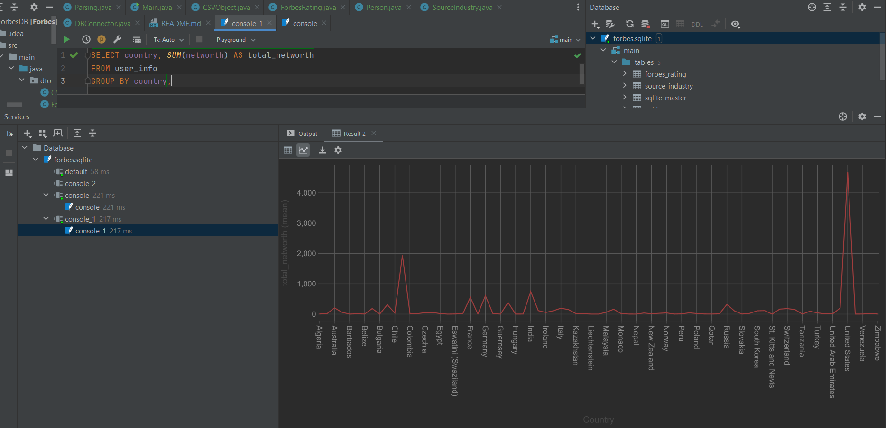
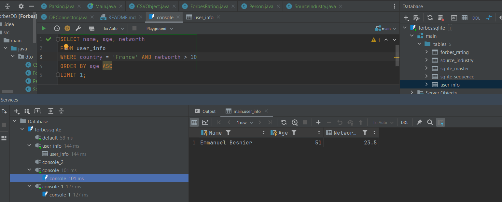
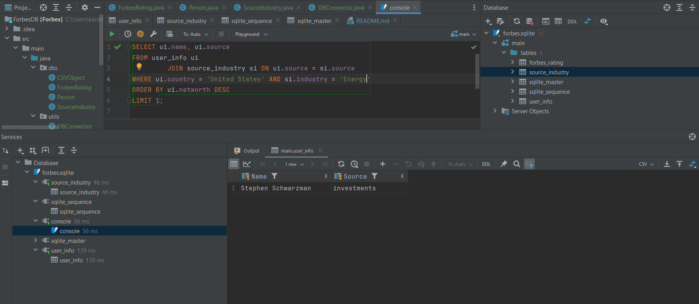

# ForbesDB
Java task for ForbesDB


## Запросы к базе

1) Постройте график общего капитала участников Forbes, объединив их по странам
```sql
SELECT country, SUM(networth) AS total_networth
FROM user_info
GROUP BY country;
```

2) Выведите самого молодого миллиардера из Франции, капитал которого превышает 10 млрд.
```sql
SELECT name, age, networth
FROM user_info
WHERE country = 'France' AND networth > 10
ORDER BY age ASC
LIMIT 1;
```

3) Выведите имя и компанию бизнесмена из США, имеющего самый большой капитал в сфере Energy.
```sql
SELECT ui.name, ui.source
FROM user_info ui
JOIN source_industry si ON ui.source = si.source
WHERE ui.country = 'United States' AND si.industry = 'Energy'
ORDER BY ui.networth DESC
LIMIT 1;
```

## Полученные данные

1) Постройте график общего капитала участников Forbes, объединив их по странам + диаграмма


2) Выведите самого молодого миллиардера из Франции, капитал которого превышает 10 млрд.


3) Выведите имя и компанию бизнесмена из США, имеющего самый большой капитал в сфере Energy.

